

    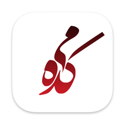

<h1 align="center">Meikade</h1>

Meikade is a collection of Persian poetry. ([Original project](https://github.com/Aseman-Land/Meikade))
This project is based on the original Meikade but entirely built in SwiftUI, making it fast, lightweight, and easier to run on other apple operation systems like visionOS or macOS.

## 🖼️ Previews
### 📱 iOS

    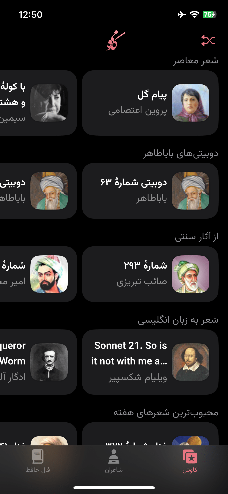
    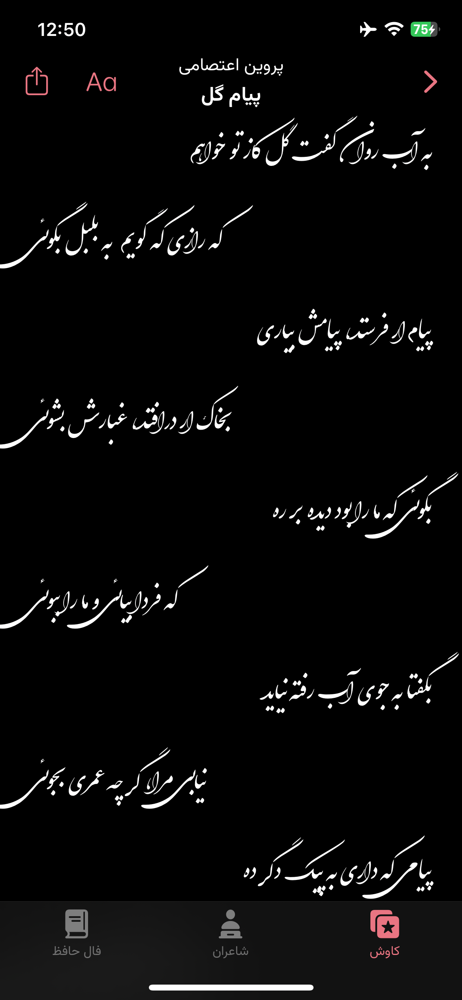

    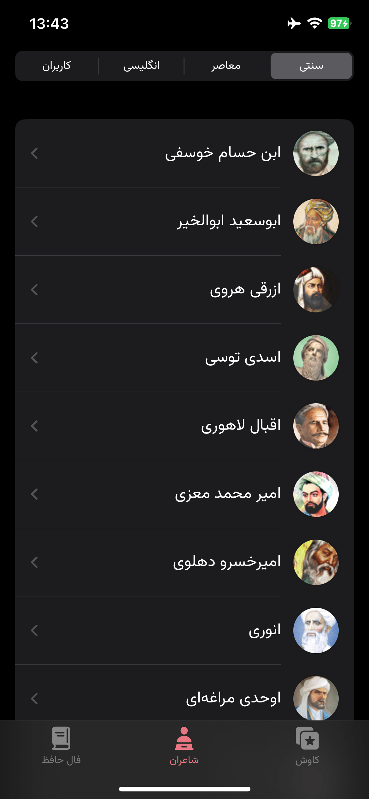
    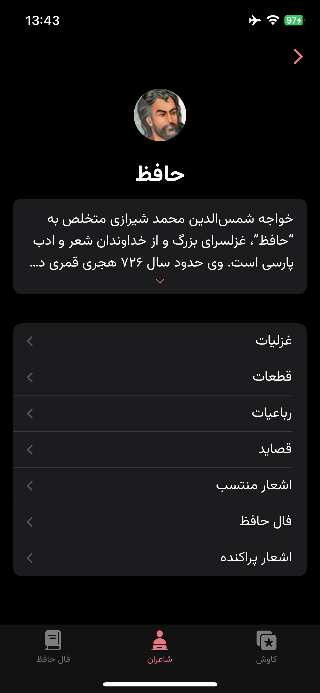

    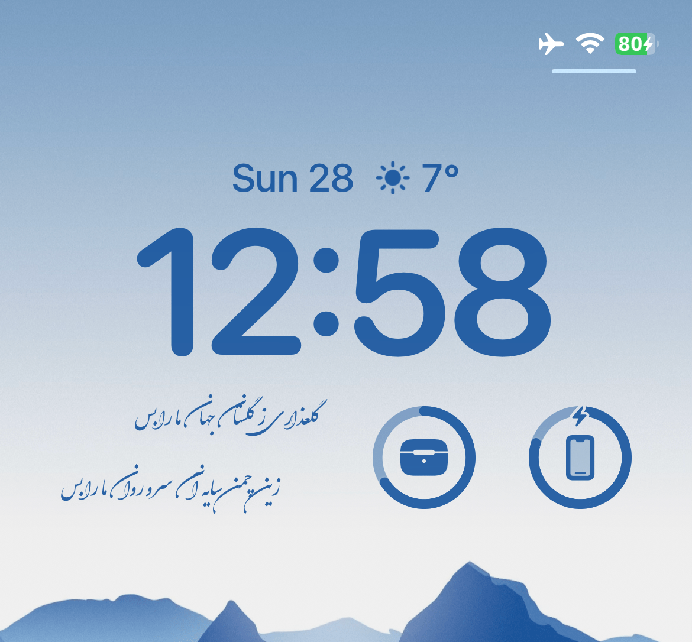
    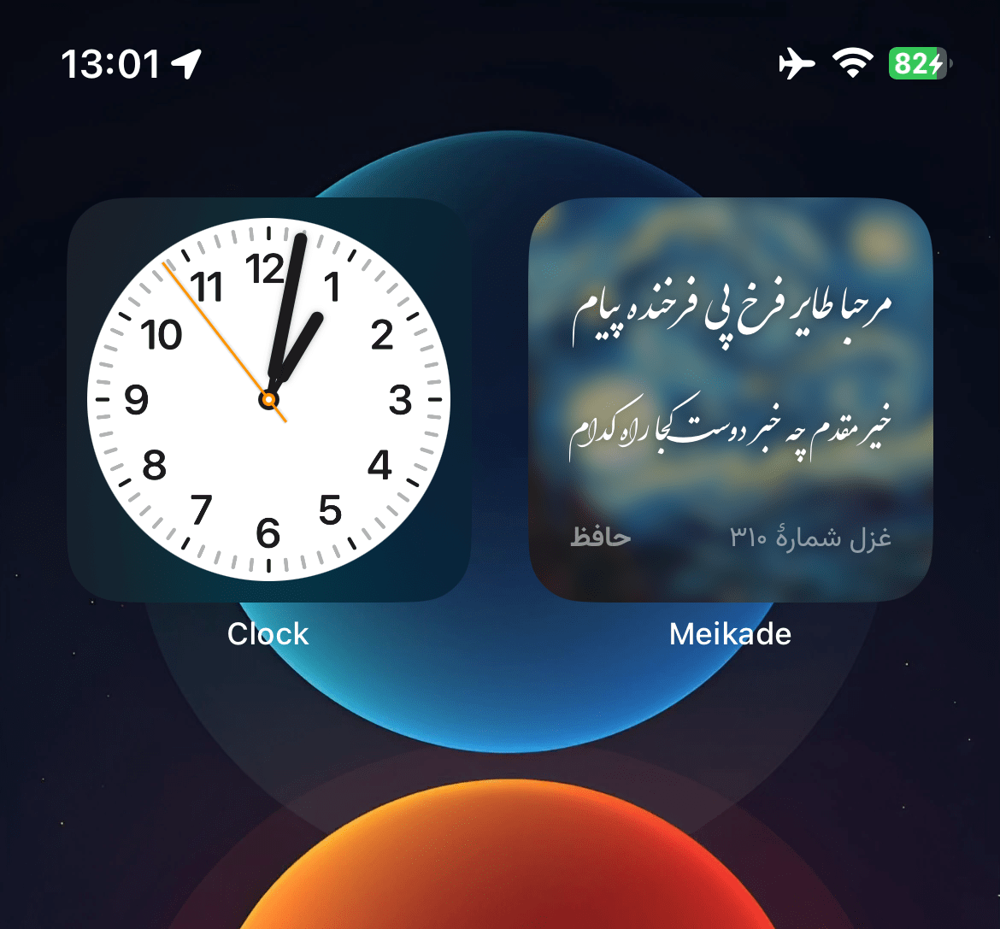

### 🖥️ Mac OS

    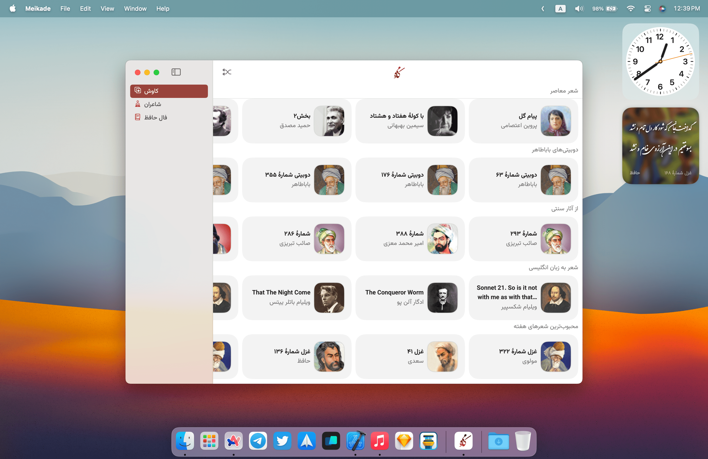
    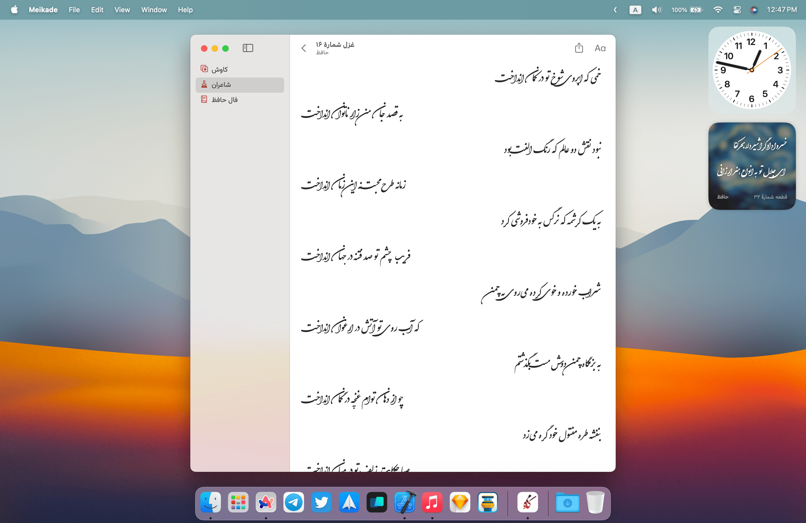

### 🥽 Vision OS

    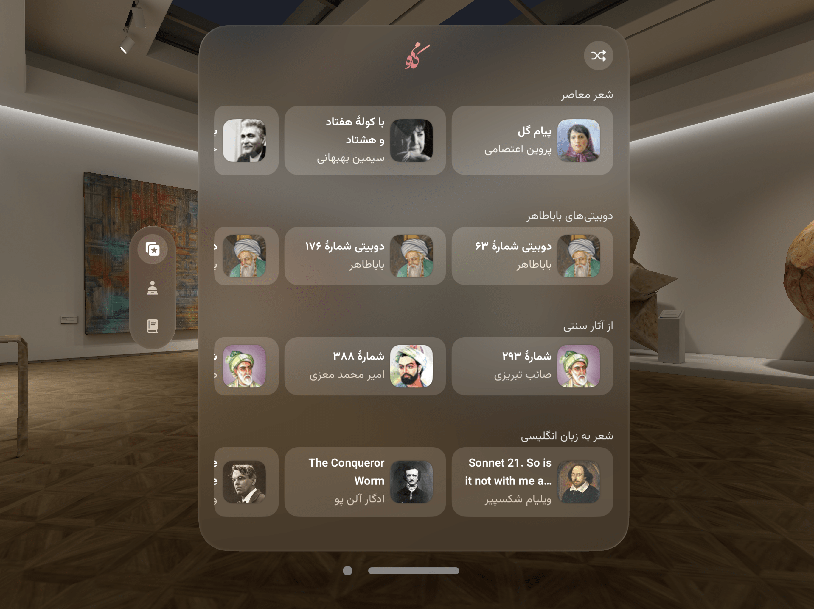
    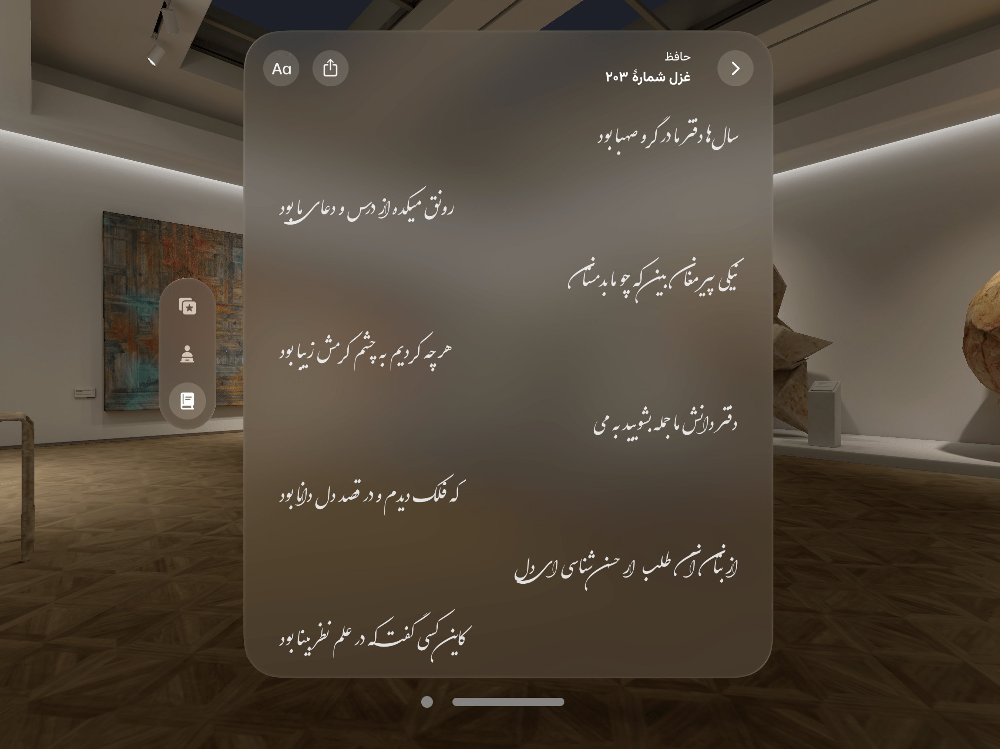

## ⚒️ Building the project

- Clone the project
- **Important:** Open __`Config.xconfig`__ file with any editor except **xcode** and change __`CONFIG_BUNDLE_ID`__'s value to your **new app bundle identifier**.
- Open the __`Meikade.xcodeproj`__ file with xcode, open the project's file and go to __`Signing & Capabilities`__ and change the __`team`__.
- Build & run.

## 🧩 Contribute 

Want to contribute? I would really appreciate a hand with the development to add more features in this app.
Feel free to Fork, edit, then pull!

## ✌🏻 Donation

## 📝 Copyright Notice

Copyright (C) 2026 Aseman
Licensed under the [GNU Version 3](https://www.gnu.org/licenses/gpl-3.0.en.html) license (see the LICENSE file).
