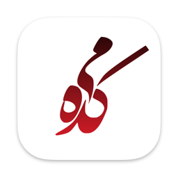

    

<h1 align="center">Meikade</h1>

Meikade is a collection of Persian poetry. ([Original project](https://github.com/Aseman-Land/Meikade))
This project is based on the original Meikade but entirely built in SwiftUI, making it fast, lightweight, and easier to run on other apple operation systems like visionOS or macOS.

> [!IMPORTANT]
> ⚠️ This project is a work in progress and does not have all the original features of the Meikade app (yet!). 

## 📱 Previews
### iOS

    
    

    
    

### Mac OS

    
    

### Vision OS

    
    

## ⚒️ Building the project

- Clone the project
- **Important:** Open __`Config.xconfig`__ file with any editor except **xcode** and change __`CONFIG_BUNDLE_ID`__'s value to your **new app bundle identifier**.
- Open the __`Meikade.xcodeproj`__ file with xcode, open the project's file and go to __`Signing & Capabilities`__ and change the __`team`__.
- Build & run.

## 🧩 Contribute 

Want to contribute? I would really appreciate a hand with the development to add more features in this app.
Feel free to Fork, edit, then pull!

## 🧭 A note on the architecture
It's a great starting point for learning SwiftUI. The app covers many of the basic concepts of SwiftUI, such as building layouts, working with data, and handling user interaction. By exploring the code, you can understand how to use SwiftUI in your daily life. Plus, the open-source nature of Meikade means you can see how real-world applications are built and get a sense of best practices for using SwiftUI.
The architecture is MV (Model-View) for keeping it simple ([more info](https://developer.apple.com/forums/thread/699003)). 

## ✌🏻 Donation

## 📝 Copyright Notice

Copyright (C) 2024 Aseman
Licensed under the [GNU Version 3](https://www.gnu.org/licenses/gpl-3.0.en.html) license (see the LICENSE file).
